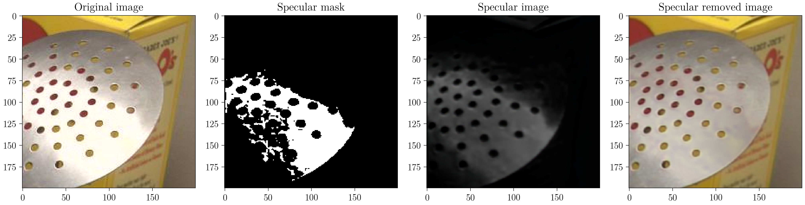
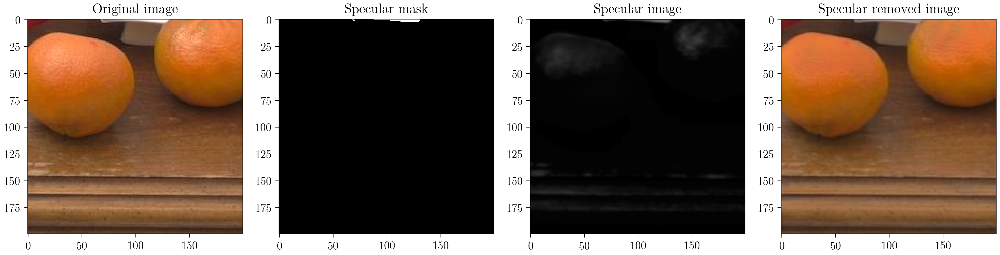
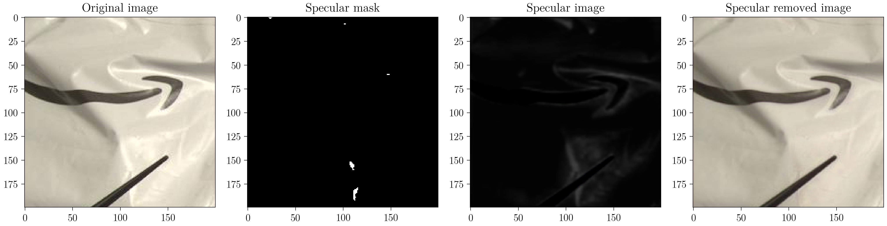

# Specular Removal
Single image specular removal based on deep learning.

## Quick start
1. Create virtual environment:

    ```shell
    conda create -n Specular_Removal python=3.8
    conda activate Specular_Removal
    pip install -r requirements.txt
    ```

2. Install `PyTorch`，refer to the [blog](https://blog.csdn.net/qq_23013309/article/details/103965619) for details；

3. Test environment:

    ```shell
    conda activate Specular_Removal
    python remove_specular.py
    ```

4. Download [dataset](https://github.com/fu123456/SHIQ) and unzip it to `./data` folder

## Train model

  ```shell
  conda activate Specular_Removal
  python train.py
  ```

## Examples





## References
* [《A Multi-Task Network for Joint Specular Highlight Detection and Removal》](http://graphvision.whu.edu.cn/papers/fugang_CVPR2021.pdf)
* [《CDFF-Net: Cumulative Dense Feature Fusion for Single Image Specular Highlight Removal》](https://shijianxu.github.io/highlight_removal.pdf)


## License
```txt
MIT License

Copyright (c) 2021 Huang Zhengzhi

Permission is hereby granted, free of charge, to any person obtaining a copy
of this software and associated documentation files (the "Software"), to deal
in the Software without restriction, including without limitation the rights
to use, copy, modify, merge, publish, distribute, sublicense, and/or sell
copies of the Software, and to permit persons to whom the Software is
furnished to do so, subject to the following conditions:

The above copyright notice and this permission notice shall be included in all
copies or substantial portions of the Software.

THE SOFTWARE IS PROVIDED "AS IS", WITHOUT WARRANTY OF ANY KIND, EXPRESS OR
IMPLIED, INCLUDING BUT NOT LIMITED TO THE WARRANTIES OF MERCHANTABILITY,
FITNESS FOR A PARTICULAR PURPOSE AND NONINFRINGEMENT. IN NO EVENT SHALL THE
AUTHORS OR COPYRIGHT HOLDERS BE LIABLE FOR ANY CLAIM, DAMAGES OR OTHER
LIABILITY, WHETHER IN AN ACTION OF CONTRACT, TORT OR OTHERWISE, ARISING FROM,
OUT OF OR IN CONNECTION WITH THE SOFTWARE OR THE USE OR OTHER DEALINGS IN THE
SOFTWARE.
```